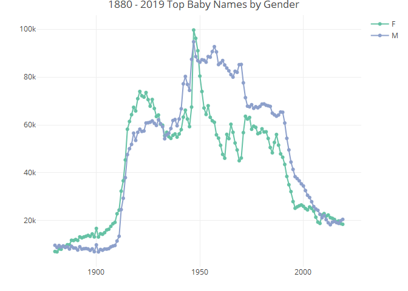

1880 - 2019 US Baby Names Analysis
================
Leopoldine Mirtil

### Source

The data used in this analysis was orignallyuploaded and made publicly
available by user Jeffrey Jex on Kaggle.com, sourced from the US Social
Security Administration. It shows the name, gender and count per year,
[link
here.](https://www.kaggle.com/datasets/jeffreyjex/us-baby-names-18802019)

Since this dataset is made up of 140 separate text files, I ended up
using Python to merge all the data files into one single dataframe that
I then used for the analysis. I also modified the data by adding a year
column to each file before combining all the files.

### Objective

1.  Determine the top 10 overall names by total per gender
2.  Identify the top baby names for each year per gender
3.  Identify the top 10 common baby names from 1880 to 2019 per gender
4.  Identify the top 10 common baby names per gender of the recent five
    years
5.  Compare the top baby names of 1880 and 2019

## Step 1 - Get Data

#### Load Library

``` r
library(tidyr)
library(tidyverse)
library(dplyr)
library(knitr)
library(plotly)
```

#### Import Data

``` r
df <- read.csv('baby_names1880-2019.txt', header=TRUE, sep = ",")
```

## Step 2 - View & Inspect Data

``` r
str(df)
```

    ## 'data.frame':    1989401 obs. of  4 variables:
    ##  $ name  : chr  "Mary" "Anna" "Emma" "Elizabeth" ...
    ##  $ gender: chr  "F" "F" "F" "F" ...
    ##  $ total : int  7065 2604 2003 1939 1746 1578 1472 1414 1320 1288 ...
    ##  $ year  : int  1880 1880 1880 1880 1880 1880 1880 1880 1880 1880 ...

#### Check for Missing/Null Values

``` r
sapply(df, function(x) sum(is.na(x)))
```

    ##   name gender  total   year 
    ##      0      0      0      0

#### Check for Empty Values

``` r
sapply(df, function(x) sum(x==""))
```

    ##   name gender  total   year 
    ##      0      0      0      0

## Step 3 - Analyze Data

#### Descriptive Analysis

``` r
summary(df)
```

    ##      name              gender              total              year     
    ##  Length:1989401     Length:1989401     Min.   :    5.0   Min.   :1880  
    ##  Class :character   Class :character   1st Qu.:    7.0   1st Qu.:1953  
    ##  Mode  :character   Mode  :character   Median :   12.0   Median :1986  
    ##                                        Mean   :  178.5   Mean   :1976  
    ##                                        3rd Qu.:   32.0   3rd Qu.:2005  
    ##                                        Max.   :99690.0   Max.   :2019

#### Count of Unique Names

``` r
length(unique(df$name))
```

    ## [1] 99444

#### Count and Total Babies by Gender

``` r
df %>%
  group_by(gender) %>%
  reframe(count = n(), 
          total_babies=sum(total))
```

    ## # A tibble: 2 × 3
    ##   gender   count total_babies
    ##   <chr>    <int>        <int>
    ## 1 F      1174655    175768302
    ## 2 M       814746    179381597

#### Annual Name Count and Total Babies

``` r
df %>%
  group_by(year) %>%
  reframe(name_count = n(),
          total_babies=sum(total)) %>%
  arrange(year)
```

    ## # A tibble: 140 × 3
    ##     year name_count total_babies
    ##    <int>      <int>        <int>
    ##  1  1880       2000       201484
    ##  2  1881       1935       192696
    ##  3  1882       2127       221533
    ##  4  1883       2084       216944
    ##  5  1884       2297       243461
    ##  6  1885       2294       240854
    ##  7  1886       2392       255317
    ##  8  1887       2373       247394
    ##  9  1888       2651       299473
    ## 10  1889       2590       288946
    ## # ℹ 130 more rows

#### Top Names by Total Babies

``` r
df %>%
  group_by(gender) %>%
  arrange(desc(total)) %>%
  group_by(gender) %>%
  slice_head(n=1)
```

    ## # A tibble: 2 × 4
    ## # Groups:   gender [2]
    ##   name  gender total  year
    ##   <chr> <chr>  <int> <int>
    ## 1 Linda F      99690  1947
    ## 2 James M      94766  1947

#### Overall Top 10 Baby Names by Total

``` r
df %>%
  group_by(gender, name) %>%
  reframe(total_babies = sum(total)) %>%
  arrange(desc(total_babies)) %>%
  group_by(gender) %>%
  slice_head(n=10)
```

    ## # A tibble: 20 × 3
    ## # Groups:   gender [2]
    ##    gender name      total_babies
    ##    <chr>  <chr>            <int>
    ##  1 F      Mary           4128052
    ##  2 F      Elizabeth      1646385
    ##  3 F      Patricia       1572330
    ##  4 F      Jennifer       1468017
    ##  5 F      Linda          1453065
    ##  6 F      Barbara        1434736
    ##  7 F      Margaret       1251234
    ##  8 F      Susan          1121986
    ##  9 F      Dorothy        1108201
    ## 10 F      Sarah          1081179
    ## 11 M      James          5177716
    ## 12 M      John           5133909
    ## 13 M      Robert         4825159
    ## 14 M      Michael        4373592
    ## 15 M      William        4131182
    ## 16 M      David          3630549
    ## 17 M      Joseph         2622654
    ## 18 M      Richard        2567406
    ## 19 M      Charles        2399300
    ## 20 M      Thomas         2318599

#### Top 10 Common Baby Names per Gender

``` r
get_mode <- function(x) {
  u <- unique(x)
  tab <- tabulate(match(x, u))
  u[tab == max(tab)]
}

df %>%
  group_by(gender) %>%
  reframe(common_names=get_mode(name)) %>%
  arrange(gender) %>%
  group_by(gender) %>%
  slice_head(n=10)
```

    ## # A tibble: 20 × 2
    ## # Groups:   gender [2]
    ##    gender common_names
    ##    <chr>  <chr>       
    ##  1 F      Mary        
    ##  2 F      Anna        
    ##  3 F      Emma        
    ##  4 F      Elizabeth   
    ##  5 F      Minnie      
    ##  6 F      Margaret    
    ##  7 F      Ida         
    ##  8 F      Alice       
    ##  9 F      Bertha      
    ## 10 F      Sarah       
    ## 11 M      John        
    ## 12 M      William     
    ## 13 M      James       
    ## 14 M      Charles     
    ## 15 M      George      
    ## 16 M      Frank       
    ## 17 M      Joseph      
    ## 18 M      Thomas      
    ## 19 M      Henry       
    ## 20 M      Robert

#### Top 10 Common Names per Gender of Recent Five Years

``` r
df %>%
  filter((year >= '2015') & (year <= '2019')) %>%
  group_by(gender) %>%
  reframe(mode_names=get_mode(name)) %>%
  arrange(gender) %>%
  group_by(gender) %>%
  slice_head(n=10)
```

    ## # A tibble: 20 × 2
    ## # Groups:   gender [2]
    ##    gender mode_names
    ##    <chr>  <chr>     
    ##  1 F      Emma      
    ##  2 F      Olivia    
    ##  3 F      Sophia    
    ##  4 F      Ava       
    ##  5 F      Isabella  
    ##  6 F      Mia       
    ##  7 F      Abigail   
    ##  8 F      Emily     
    ##  9 F      Charlotte 
    ## 10 F      Harper    
    ## 11 M      Noah      
    ## 12 M      Liam      
    ## 13 M      Mason     
    ## 14 M      Jacob     
    ## 15 M      William   
    ## 16 M      Ethan     
    ## 17 M      James     
    ## 18 M      Alexander 
    ## 19 M      Michael   
    ## 20 M      Benjamin

#### Top 10 Names of 1880 & 2019 by Total

``` r
df %>%
  filter( (year == '1880') | (year == '2019')) %>%
  group_by(year, gender, name) %>%
  reframe(total_babies = sum(total)) %>%
  arrange(year, gender, desc(total_babies)) %>%
  group_by(year, gender) %>%
  slice(1:10)
```

    ## # A tibble: 40 × 4
    ## # Groups:   year, gender [4]
    ##     year gender name      total_babies
    ##    <int> <chr>  <chr>            <int>
    ##  1  1880 F      Mary              7065
    ##  2  1880 F      Anna              2604
    ##  3  1880 F      Emma              2003
    ##  4  1880 F      Elizabeth         1939
    ##  5  1880 F      Minnie            1746
    ##  6  1880 F      Margaret          1578
    ##  7  1880 F      Ida               1472
    ##  8  1880 F      Alice             1414
    ##  9  1880 F      Bertha            1320
    ## 10  1880 F      Sarah             1288
    ## # ℹ 30 more rows

## Step 4 - Visualizations

<!-- -->

<!-- -->

<!-- -->
